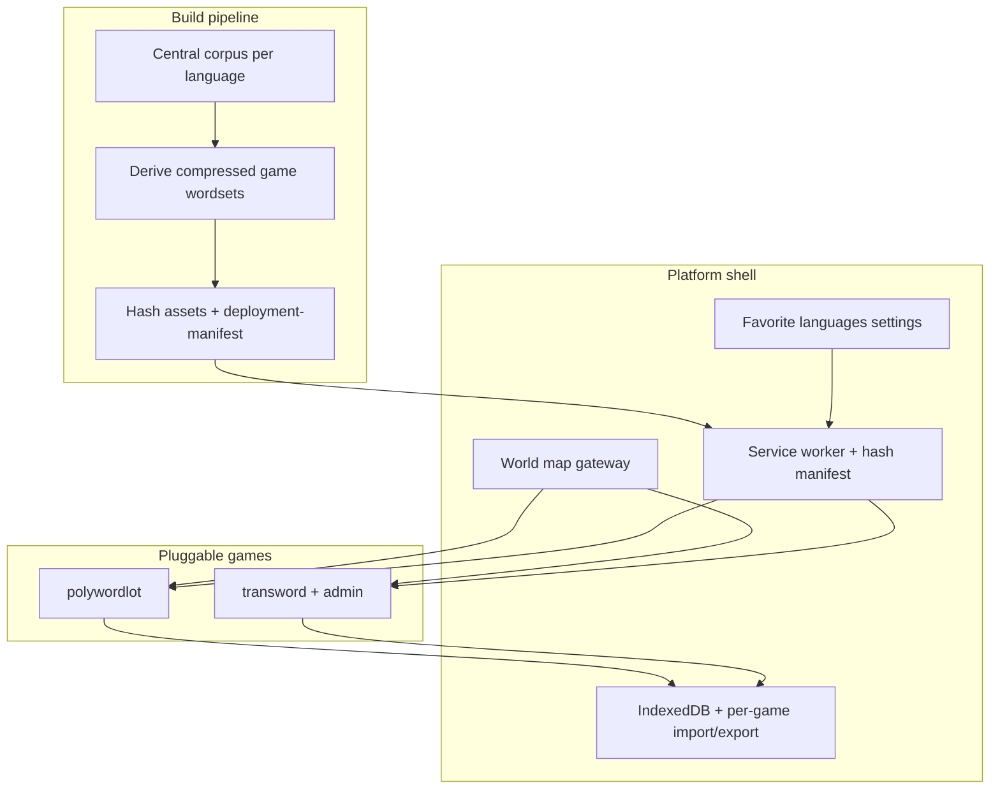

# Wordaholic offline multi-game platform

Approved design record from planning interview (2026-08-09). Source conversation architecture notes: [ChatGPT share](https://chatgpt.com/share/6a78daee-7448-83e8-834b-228c6c7f2298).

## Goal

Ship a public, offline-first word-games site at **wordaholic.com** (Render static) where users pick a language on a world map, then launch independently pluggable games. v1 games: **PolyWordlot** and **TransWord**. Memorandom is out of v1.

## Scope

**In:** vanilla static shell + PWA; map gateway; favorite languages; build-time central word corpus → per-game wordsets; content-hash updates; IndexedDB + per-game import/export; PolyWordlot vanilla port (local daily/training/stats, no server); TransWord player + password-gated admin.

**Out:** Memorandom; cloud accounts/sync; final curated master-dictionary design; detailed export merge rules (parked).

## Constraints

- Runtime: prefer pure static; Node allowed at build (and runtime only if later forced).
- Games own their screens; shell owns languages, offline/update, word delivery, storage envelope.
- Full plugin contract for interface standardization; per-game semantics for state/stats.
- Updates mandatory; if a session is active → **Update now** or **Update when this game ends** (no ignore forever).

## Design decisions (interview)

| Branch | Decision |
|--------|----------|
| Product | Public users; PolyWordlot + TransWord playable; Memorandom skipped; per-game language sets may differ |
| Platform | Render static; vanilla preferred; PolyWordlot rewrite OK; Node OK at build/runtime if needed; domain wordaholic.com |
| Plugin contract | IDs `polywordlot`, `transword`; independent screens; shared favorite languages; Full contract with per-game semantics; offline required |
| Word data | Each game keeps dictionaries in its original layout (copied from mlw/transword); shell catalog is derived by scanning those trees |
| Gateway UX | Realistic world map (no flags); Languages dropdown for favorites; game icons on map positioned from favorite languages |
| Persistence | IndexedDB; per-game import/export; smart stats preservation rules later; schemas parked |
| Offline/updates | Cache shell + games + favorite-language wordsets; hash manifest; preparing-offline UX; mandatory session-aware upgrades |
| Migration | Old repos read-only sources; PolyWordlot drop auth/server; TransWord keep admin behind client-side password |

## Architecture

### Repo layout (canonical: `wordaholic`)

- Site root / `public/`: shell HTML/CSS/JS, SW, manifest
- `app/shell/`, `app/storage/`, `app/updates/`, `app/i18n-prefs/`
- `games/polywordlot/`, `games/transword/` (+ admin)
- `word-data/<lang>/` master source (imported from mlw/transword initially)
- `scripts/` build: cleanse → derive wordsets → compress → hash → `deployment-manifest.json`
- Old repos (`mlw`, `transword`) remain **read-only sources** to port from

### Navigation

- `/` — realistic world map (no flags); **game icons** placed from favorite languages
- `/games/polywordlot/…`, `/games/transword/…` (exact paths deferred but stable **game IDs**: `polywordlot`, `transword`)
- **Languages** dropdown: pick favorite languages (offline cache + map placement)
- Admin: TransWord admin UI kept; gated by a **single hardcoded client-side password** (changeable in source). On a static site this deters casual access only; it is not server-grade secrecy.

### Word data

- Dictionaries live under each game in the **same structure as the old apps**:
  - `games/polywordlot/dict/<Language>/<locale>/…`
  - `games/transword/data/languages/<Dir>/…`
- Synced from sibling repos via `npm run sync-dicts`
- Shell `data/languages.json` is generated by scanning those trees at build time

### Offline / updates

- First load: **“preparing offline…”** until shell + both games + favorite-language wordsets are cached
- `deployment-manifest.json` with content hashes (hashed filenames where practical)
- Online check → show what changed → mandatory upgrade with session-aware timing
- Persist schema IDs only where IndexedDB compatibility needs migration

### Game ports

| Game | Source | v1 approach |
|------|--------|-------------|
| PolyWordlot | `/Users/ilya/cursor/mlw` | Rewrite to vanilla; keep gameplay, daily/training, local stats/calendar; drop auth/API/Postgres |
| TransWord | `/Users/ilya/cursor/transword` | Port `graph.js` / `solver.js` / player UI; keep admin behind password gate |
| Memorandom | — | Skipped |

Reuse: mlw game logic/normalization/keyboard concepts; TransWord graph/solver and corpus levels; language.json patterns (keyboard, RTL, normalization).

### Persistence

- IndexedDB for results/stats/settings
- **Per-game** import/export; “smart preserve stats” rules discussed later
- Shell may share favorite-language prefs only

## Success criteria

- Airplane mode: map + both games playable for cached favorite languages
- Language sets can differ per game; PolyWordlot starts with its existing language set
- Online visit detects hashed changes and applies mandatory session-aware update
- Progress survives reload; per-game export/import works at a basic level
- New game can register via the plugin contract without rewriting the shell

## Implementation order

1. Scaffold static site + SW + manifest hashing + preparing-offline UX
2. Shell: map gateway, language home, favorites settings, plugin registry (full contract stubs)
3. Word pipeline: import mlw/transword → derive compressed wordsets for both games
4. Port TransWord player + gated admin onto contract
5. Rewrite PolyWordlot vanilla onto contract (local daily/training/stats)
6. IndexedDB + per-game import/export skeleton
7. Render static deploy wiring; domain `wordaholic.com` when purchased

## Parked / later

- Memorandom
- Rich master-corpus linguistics and near-100% cleansing automation polish
- Exact export merge/preservation rules
- Final URL path scheme and brand visual system beyond functional SVG map
- Hardening admin beyond client-side password (if ever needed)

## Risks

- PolyWordlot vanilla rewrite is the largest slice — mitigate by porting logic modules before UI chrome
- Large dictionaries + compression/SW caching need careful quota testing on mobile
- Client-side admin password is intentional soft gate only

## Implementation todos

- [ ] Scaffold wordaholic static shell, SW, hash manifest, preparing-offline UX
- [ ] World map language gateway, language home, favorite-language settings, plugin registry
- [ ] Import mlw/transword data; build-time derive + compress per-game wordsets
- [ ] Port TransWord player + password-gated admin to plugin contract
- [ ] Vanilla rewrite of PolyWordlot (daily/training/local stats; no server)
- [ ] IndexedDB + per-game import/export skeleton
- [ ] Render static deploy wiring; prepare for wordaholic.com
