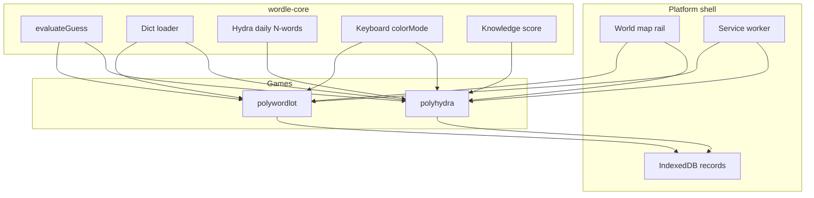
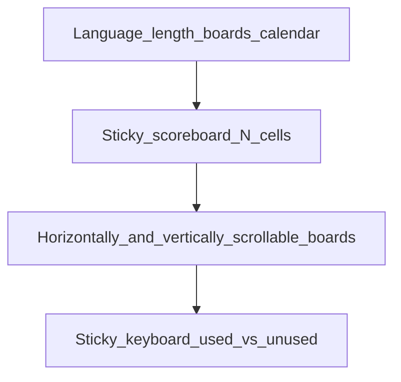

# PolyHydra

Approved design record from planning interview (2026-08-29). Third Wordaholic game: PolyWordlot rules on several boards at once.

## Goal

Ship **PolyHydra** (`polyhydra`) as a map-launched game: one shared guess scored on every board that is not solved yet, shared PolyWordlot vocabulary, daily puzzles that differ by board count, a sticky yellow completion scoreboard, and PolyWordlot-style calendar, stats, and export.

## Scope

**In:** new `games/polyhydra/` app; shared wordle core used by PolyWordlot and Hydra; one copy of PolyWordlot dictionaries; Daily (no Practice in v1); calendar; persist/export; statistics; help topic; shell/catalog/SW/offline/stats-delta wiring.

**Out:** Practice mode; extra-attempt values other than 5 (the per-count map exists so they can change later); moving dictionary files off `games/polywordlot/dict`; real help screenshots; changing PolyWordlot’s shake-on-invalid or evaluation-colored keyboard.

## Constraints

- Same letter coloring on boards as PolyWordlot (green / yellow / gray; white while typing).
- Vocabulary is **shared at runtime** with PolyWordlot (same `answers-*` / `dictionary-*` files). This is a deliberate exception to the platform note in [PLAN.md](PLAN.md) that each game’s word tree is independent. Hydra must not copy those files.
- Do not freeze a second Wordle engine. Extract a small shared core; PolyWordlot keeps its own screens and behavior.

## Design decisions (interview)

| Branch | Decision |
|--------|----------|
| Gameplay | One shared guess, scored on every unsolved board. Solved boards ignore later guesses. Secrets may repeat. |
| Word length | Same language + length picker as PolyWordlot (per-language 4–7). |
| Attempts | Pool size = `boardCount + extra(boardCount)`. `extra` is a map for 2..20, all values **5** for now. |
| Daily identity | Date + language + word length + board count. Each combo is its own daily. |
| Answer pool | Same `answers-*` lists as PolyWordlot Daily. |
| Modes | Daily only in v1 (no Practice). |
| Keyboard | Used = letter appeared in a submitted guess. Unused vs used key backgrounds differ. No green / yellow / gray on keys. |
| Scoreboard | Accumulated knowledge (never decreases): `1.0 × locked-green positions + 0.7 × known-present unplaced letters`. White at 0, full yellow at 4.4 (clamp). Solved = green. Tap a cell to scroll that board into view. Fixed at top; not in the board scroller. All N cells visible (shrink to fit). |
| Boards | Natural PolyWordlot-like tile size; horizontal + vertical scroll on the board strip. Full `N+5` rows on every board; unused rows after a solve stay empty. |
| Invalid word | Incomplete + Return: ignore. Unknown word + Return: current row red on every unsolved board, stays red. Second Return clears. No attempt used. Typing/backspace while red returns to normal typing. |
| Default boards | Remember last used count. First visit: **16**. Range 2–20. |
| Stats | Wins by shared guess count `1…N+5`; loss bucket `N+6`. Split by language + length + board count. |
| Help | Topic in v1; screenshots may be placeholders until captured. |
| Architecture | Shared package (e.g. `packages/wordle-core`) imported by both games. Dict loader base URL defaults to `/games/polywordlot/dict/`. |

## Architecture

### Shared core

`packages/wordle-core/` (Vite alias `@wordaholic/wordle-core`, same pattern as existing `@wordaholic/*` aliases):

- Types, `evaluateGuess`, `isValidWord`, character normalization, dictionary/keyboard loader
- Loader dict base URL defaults to `/games/polywordlot/dict/`
- Daily seed + N-word pick (Hydra tag so it cannot collide with the one-board PolyWordlot hash)
- Knowledge score for the scoreboard
- Keyboard `colorMode: 'evaluation' | 'used-unused'`

PolyWordlot is refactored only to import the core. It keeps Game, persistence, shake-on-invalid, 6-guess cap, Practice, and evaluation-colored keys.

### Daily words

- Seed string: `YYYYMMDD-language-wordLength-boardCount` plus a Hydra-specific tag
- PRNG from that seed; pick `boardCount` words from `answerWords` **with replacement**

### Hydra app

Vite + React sibling of PolyWordlot (`games/polyhydra/`, distinct dev port from 5174).

- Board-count dropdown 2–20
- Persistence key: `language|word_length|board_count|game_date`
- On lose: show remaining targets on unsolved boards
- Portrait gate; `setSessionActive('polyhydra')` like TransWord

### UI layout

Current guess is shown on all unsolved boards at the same row index.

## Shell / storage / help

- **Home map rail:** third icon **under TransWord**. `registerGame` order in `app/main.js` is PolyWordlot, TransWord, PolyHydra (`listGames()` is insertion order). Catalog lists `polyhydra` for the same languages as PolyWordlot so the icon shows for those favorites.
- **Rail icon:** `GAME_ICONS.polyhydra` in `app/shell/map.js` — a **many-headed Hydra** (same 40×40 rounded-rect wash and `currentColor` stroke as the other rail icons). About 3–5 heads/necks so it reads as a hydra at small size. Do not reuse the PolyWordlot 3×3 grid.
- `app/games-contract.js` `KNOWN_GAME_IDS`: `polywordlot`, `transword`, `polyhydra`
- `app/main.js` `registerGame` (after TransWord)
- `app/shell/map.js` Hydra icon
- `word-data/languages.json` and `scripts/build-languages-catalog.js`: if PolyWordlot lengths exist, also list `polyhydra` (same dict; no second word tree)
- `scripts/build.js`: Vite-build into `dist/games/polyhydra`, hash `manifest.games.polyhydra`
- `app/shell/offline-prep.js`, `app/updates/service-worker.js`, `app/updates/manifest.js`
- **Anonymous site `/stats`:** **not in this game’s slice.** Hydra still emits `reportStats({ games: { polyhydra: { 'en,5,16': 1 } } })` on first daily guess. Making ingest/store/`/stats` columns follow a game registry so PolyHydra (and later games) appear automatically is the **current stats workflow**.
- Export/import: dedicated Hydra branch in `app/storage/export-records.js` (do **not** reuse `guesses.length >= 6`). Record stores `board_count`, `target_words[]`, and per-board guess lists. `app/shell/site-backup.js` copy lists Hydra
- Help: `app/help/topics.js`; placeholders under `public/help/polyhydra/`
- Site help export blurb should name Hydra with the other games

## Success criteria

- Open Hydra: first visit is 16 boards; last count is remembered
- 2-board and 20-board dailies on the same date/language/length are unrelated
- Scoreboard colors and click-to-scroll work; keyboard is used vs unused only
- Invalid word: red, then second Return clears; no attempt used
- Solved board ignores later guesses; lose at `N+5` if any board is open
- Calendar, stats, and export work for a finished daily
- PolyWordlot Daily still plays and still colors keys as today

## Implementation order

1. Extract `packages/wordle-core` and point PolyWordlot at it with no behavior change
2. `games/polyhydra`: multi-board state, N+5 grid, sticky scoreboard, used/unused keyboard, invalid red + second Return, board count 2–20
3. Hydra IndexedDB records, calendar, stats, export/import including `board_count`
4. Register in contract, map (Hydra icon), catalog, build, SW, offline-prep, help, portrait gate, session-active

## Parked / later

- Practice mode
- Extra-attempt values other than 5
- Moving dictionary files off `games/polywordlot/dict`
- Real help screenshots
- Changing PolyWordlot invalid-word or keyboard behavior
- Site `/stats` ingest and table (current stats workflow: registry so new games including PolyHydra are picked up automatically; Hydra permutation key `lang,length,boardCount`)

## Risks

- Extracting the core can regress PolyWordlot — keep its UX identical and verify Daily + key colors
- 16 boards × 21 rows needs both horizontal and vertical scroll at readable tile size
- Export completion must use Hydra’s `N+5` rule, not PolyWordlot’s six-guess check
